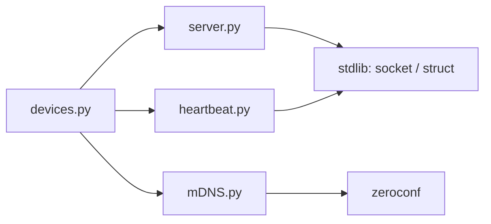

# Connectivity Checker

A multi-threaded Python server for managing, discovering, and monitoring a fleet of networked IoT devices (referred to as "Nameplates"). It combines low-level TCP socket communication, mDNS service discovery, and a live console dashboard to give you a real-time view of which devices are reachable on the network.

## Table of Contents

- [Overview](#overview)
- [Features](#features)
- [Architecture](#architecture)
- [Detection Algorithm](#detection-algorithm)
- [Installation](#installation)
- [Configuration](#configuration)


## Overview

The server acts as a central hub for IoT devices. It announces itself on the local network via mDNS so devices can find it automatically, accepts their TCP connections, and then continuously verifies their reachability using two independent mechanisms: an application-level heartbeat and OS-level ICMP pings.


## Features

- **TCP Socket Server** — handles raw socket connections and binary data streams
- **mDNS Discovery** — broadcasts availability via Zeroconf (`_nameplate2._tcp.local.`), so devices find the server without manual configuration
- **Heartbeat Mechanism** — background thread sends periodic keep-alive bytes to all connected devices in round-robin order
- **ICMP Ping Checker** — independently verifies network-layer reachability for each device
- **Live Dashboard** — console UI that refreshes every 0.5s showing connected and disconnected devices with their IPs
- **Binary Protocol** — supports `struct`-packed command frames (e.g. `SetErrorTimeout`)


## Architecture

```
devices.py  (entry point)
├── server.py      — TCP server, handshake parsing, connection registry
├── mDNS.py        — Zeroconf service registration
└── heartbeat.py   — round-robin keep-alive sender
```



Module responsibilities:

- `devices.py` — entry point; loads config, starts all threads, runs the dashboard loop
- `server.py` — binds the TCP socket, accepts connections, extracts MAC addresses from handshakes, exposes the connection registry
- `mDNS.py` — registers the service with Zeroconf so devices can locate the server via mDNS
- `heartbeat.py` — iterates over all open sockets and sends a null byte to each; detects dead connections via socket errors


## Detection Algorithm

Connectivity status is determined by combining two independent checks that run in parallel background threads.

**Step 1 — Device discovery via mDNS**

On startup, the server registers a `_nameplate2._tcp.local.` service record using Zeroconf. Devices on the same LAN query for this service type and learn the server's IP and port automatically.

**Step 2 — TCP handshake and MAC registration**

When a device connects, it sends a 60-byte handshake. The server decodes the payload and extracts the MAC address starting at byte offset 3. This MAC becomes the unique key for that device in the connection registry.

**Step 3 — Application-layer heartbeat (TCP liveness)**

A dedicated thread loops over all registered sockets in round-robin order and sends a single null byte (`0x00`) to each. If the send raises `BrokenPipeError` or `ConnectionResetError`, the TCP session is considered dead and a warning is logged. The interval between sends is configurable (default 0.1s).

```
for each device in round-robin order:
    send 0x00
    if BrokenPipeError or ConnectionResetError:
        log warning (connection lost)
    sleep(interval)
```

**Step 4 — Network-layer reachability check (ICMP ping)**

Independently, a background pinger thread queries each device's IP using the OS `ping` command once per second. This catches cases where the TCP session is still technically open but the device is no longer reachable on the network (e.g. it lost its IP or the route changed).

```
for each device:
    run: ping -c 1 -W 1 <ip>
    record result as True/False
sleep(1s) then repeat
```

**Step 5 — Dashboard**

Once the expected number of devices (`COUNT` in config) are connected, the dashboard activates. It reads the latest ping results and splits devices into "connected" and "not connected" columns, refreshing every 0.5 seconds. If a device drops below the expected count, the dashboard pauses and waits for it to reconnect.


## Installation

Clone the repository and install dependencies. Using a virtual environment is recommended:

```bash
git clone https://github.com/DexusY/Connectivity_checker.git
cd Connectivity_checker
python3 -m venv venv
source venv/bin/activate
pip install -r requirements.txt
```

Run the server:

```bash
python devices.py
```


## Configuration

All settings live in `settings.conf`. Edit this file before starting the server.

```ini
[NETWORK]
HOST_IP = 192.168.1.100  ; your machine's local IPv4 address
PORT = 8088              ; TCP listening port (also advertised via mDNS)

[DEVICES]
COUNT = 45               ; number of devices the dashboard waits for

[SERVER]
PASSWORD = changeme      ; password used during device handshake
```

The `HOST_IP` must match the network interface you want devices to connect through. Running `ip addr` or `ifconfig` will show your available interfaces and their addresses.
