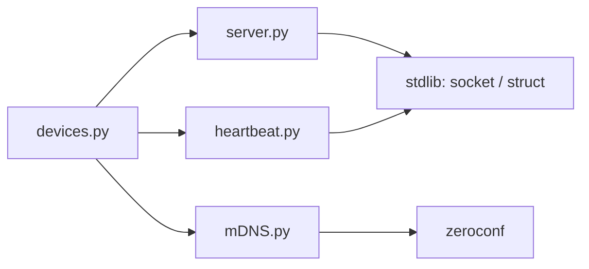

# Connectivity Checker

Multi-threaded Python server for managing and monitoring a fleet of networked IoT devices (Nameplates). Combines TCP socket handling, mDNS service discovery, and a live console dashboard to show which devices are actually reachable at any given moment.

## Table of Contents

- [Overview](#overview)
- [Features](#features)
- [Architecture](#architecture)
- [Detection Algorithm](#detection-algorithm)
- [Installation](#installation)
- [Configuration](#configuration)


## Overview

The server acts as a central hub. It announces itself on the LAN via mDNS so devices can find it without manual configuration, accepts their TCP connections, and then continuously verifies reachability through two independent mechanisms: an application-level heartbeat and OS-level ICMP pings.


## Features

- **TCP Socket Server** — raw socket connections and binary data streams
- **mDNS Discovery** — broadcasts via Zeroconf (`_nameplate2._tcp.local.`) so devices self-register without hardcoded IPs
- **Broadcast Heartbeat** — sends keep-alive bytes to all connected devices simultaneously on each tick
- **ICMP Ping Checker** — independently verifies network-layer reachability per device
- **Live Dashboard** — refreshes every 0.5s, shows connected vs. unreachable devices with IPs; works with any number of connected devices
- **Binary Protocol** — supports `struct`-packed command frames (e.g. `SetErrorTimeout`)


## Architecture

```
devices.py  (entry point)
├── server.py      — TCP server, handshake parsing, connection registry
├── mDNS.py        — Zeroconf service registration
└── heartbeat.py   — broadcast keep-alive sender
```



Module responsibilities:

- `devices.py` — entry point; loads config, starts all threads, runs the dashboard loop
- `server.py` — binds the TCP socket, accepts connections, extracts MAC addresses from handshakes, exposes the connection registry
- `mDNS.py` — registers the service with Zeroconf so devices can locate the server via mDNS
- `heartbeat.py` — blasts a null byte to every open socket in one pass per interval; detects dead connections via socket errors


## Detection Algorithm

Two independent background threads determine connectivity status in parallel.

**Step 1 — Device discovery via mDNS**

On startup the server registers a `_nameplate2._tcp.local.` service record via Zeroconf. Devices on the same LAN query for this service type and get the server's IP and port automatically.

**Step 2 — TCP handshake and MAC registration**

When a device connects it sends a 60-byte handshake. The server decodes the payload and pulls the MAC address from byte offset 3 onward. That MAC becomes the unique key for the device in the connection registry.

**Step 3 — Application-layer heartbeat (TCP liveness)**

A dedicated thread sends a single null byte (`0x00`) to every registered socket in one tight loop, then sleeps for the configured interval. All devices get hit on the same tick — no staggering, no round-robin delay.

```
loop every interval:
    for each connected device:
        send 0x00
        if BrokenPipeError or ConnectionResetError:
            log warning (connection lost)
sleep(interval)
```

**Step 4 — Network-layer reachability (ICMP ping)**

A separate pinger thread runs `ping -c 1 -W 1 <ip>` for each device once per second. This catches cases where the TCP session is still open but the device is gone from the network — lost IP, changed route, etc.

```
for each device:
    ping -c 1 -W 1 <ip>
    record True/False
sleep(1s) then repeat
```

**Step 5 — Dashboard**

The dashboard starts immediately and shows whatever is currently connected. It reads the latest ping results and splits devices into connected and not-connected columns, refreshing every 0.5 seconds. No minimum device count required.


## Installation

Clone the repo and install dependencies. A virtual environment is strongly recommended:

```bash
git clone https://github.com/DexusY/Connectivity_checker.git
cd Connectivity_checker
python3 -m venv venv
source venv/bin/activate
pip install -r requirements.txt
```

Run:

```bash
python devices.py
```


## Configuration

All settings live in `settings.conf`. Edit before starting the server.

```ini
[NETWORK]
HOST_IP = 192.168.1.100  ; your machine's local IPv4 address
PORT = 8088              ; TCP port (also advertised via mDNS)

[SERVER]
PASSWORD = changeme      ; used during device handshake authentication
```

`HOST_IP` must match the interface you want devices to connect through. Run `ip addr` or `ifconfig` to find it.
